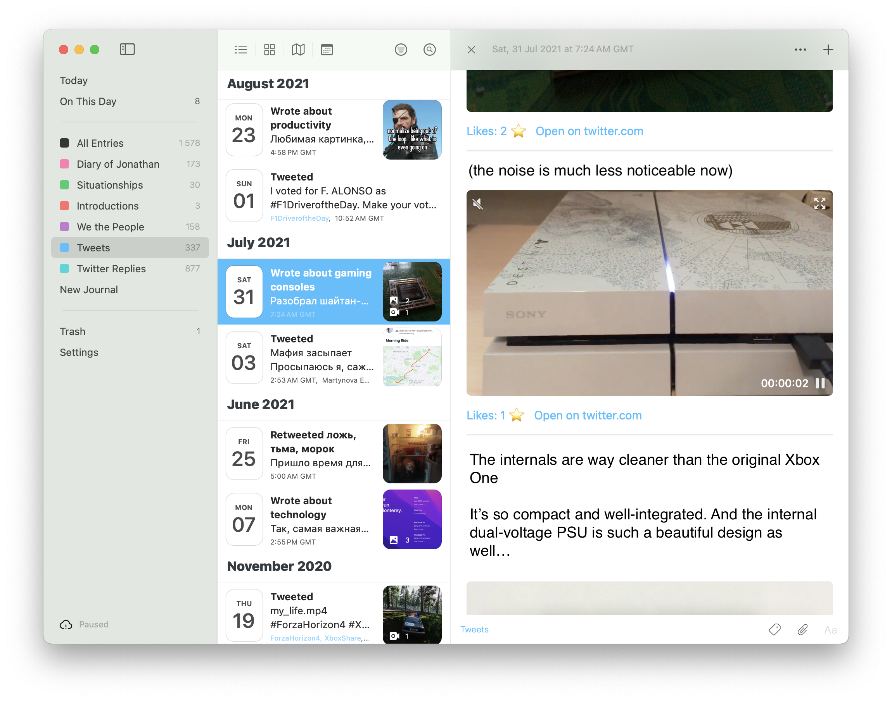
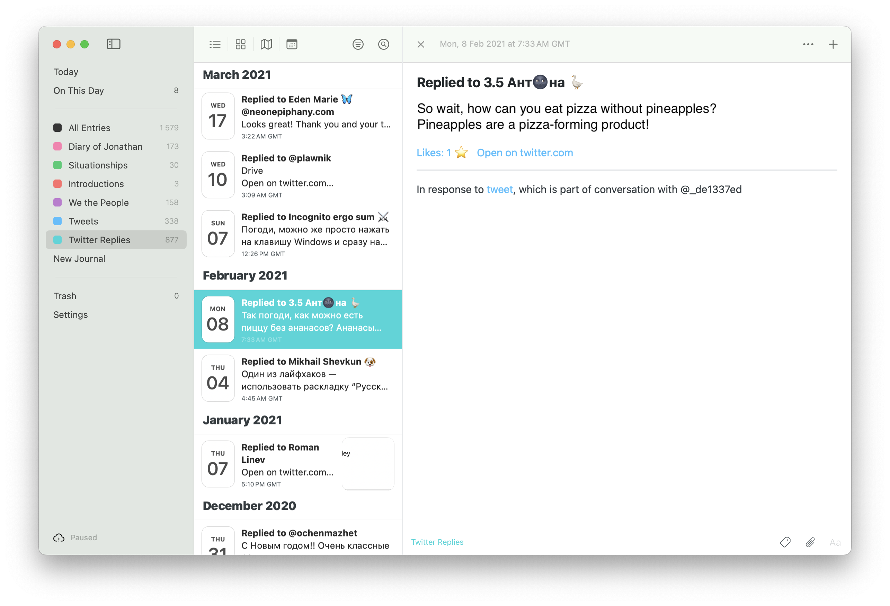
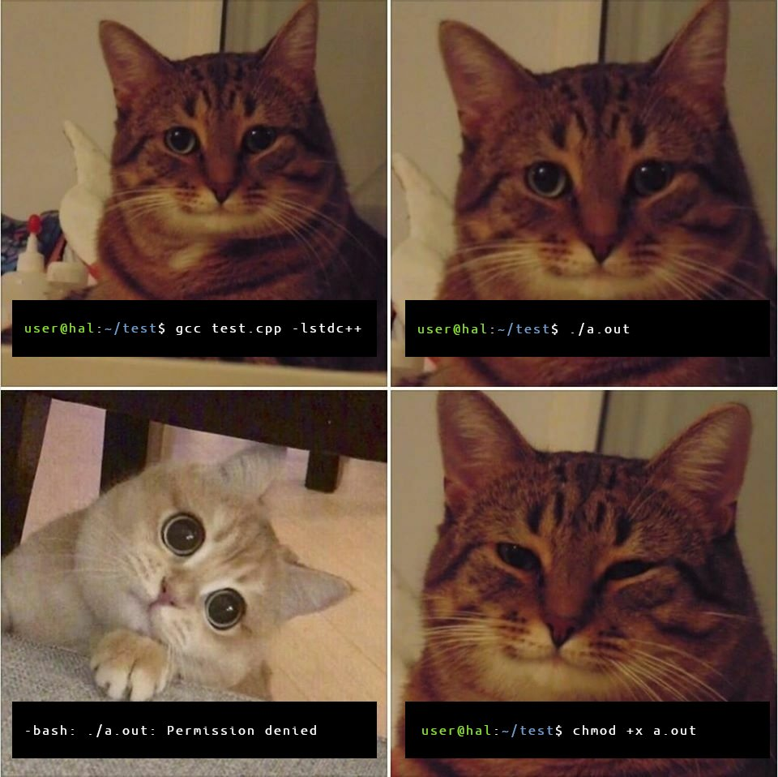

## Twixodus

The **ultimate** tool to seamlessly import your Twitter archive into the [Day One journaling app](https://dayoneapp.com)!


---

### What for?

By importing your Twitter archive into Day One with this script, you can:

- Browse your entire tweet history offline with lightning-fast random access
- Rediscover what you posted “on this day“ in past years—like [Timehop](https://www.timehop.com), but with no limitations
- Browse all your tweeted photos and videos in a sleek, organized gallery
- Perform full-text searches that actually work
  - Easily purge any unwanted [kompromat](https://en.wikipedia.org/wiki/Kompromat) from your old tweets



---

### What's so good about this script?

- Beautifully classifies pure tweets, threads, retweets, quote-tweets, replies, etc., and acts accordingly
- Handles threads _gracefully_ and combines them into single, cohesive Day One entries
- Supports media attachments, hashtags, locations
- Appends like/retweet count under each tweet

I've meticulously analysed nearly every edge case to ensure your tweets will render flawlessly in Day One.



---

### Caveats

- Day One’s free plan lets you add just one attachment per entry. Subscribe to Premium ¯\\\_(ツ)\_/¯ (free trial available, feel free to cancel it right away)
- This script only works on macOS Sonoma and newer. If you don't have a Mac, find a friend who does or spin up the virtual machine.

---

### Usage

1. **Download your Twitter data**  
   Request your archive [here](https://x.com/settings/download_your_data).

2. **If you haven’t used Day One before:**

   - Install Day One app from the [App Store](https://apps.apple.com/tr/app/day-one/id1055511498?mt=12).
   - Open it and (optionally) sign in.

3. **Install the Day One CLI**  
   Follow the [instructions](https://dayoneapp.com/guides/day-one-for-mac/command-line-interface-cli/).

4. **Create a journal for tweets**  
   Go to [dayone://preferences](dayone://preferences), open **Journals**, and add one named `Tweets` (or see [config options](#config-options)).

5. **(Optional) Create a journal for replies**  
   If you want to include replies, add another journal called `Twitter Replies` (or see [config options](#config-options)).

6. **(Optional) Pause sync**  
   Day One will attempt to sync new posts into the cloud automatically. If you're using unreliable or metered connection, you might want to visit Day One preferences → **Sync**, and click **Pause sync for 24 hours**.

7. **Extract your archive**  
   Place the `twitter~.zip` file in this project folder and unzip it.

8. **(Optional) enable naming of threads by LLM**

   ```bash
   brew install --cask ollama-app
   ollama pull qwen3:8b
   ollama serve
   ```

   - Will produce results such as “a thread about Formula 1“ or “a thread about second-hand shopping“.
   - Runs quickly on Macs with M-series processors and 16 GB+ of RAM. If your Mac has an Intel processor or less memory, pull the lighter `qwen3:4b` model instead.
   - Downloads 5.2 gb of data, so be mindful of metered connections.
   - After you're done with the script, run `ollama rm qwen3:8b` to delete the model.

9. **Modify configuration and launch the script!**

### Config options

Before launching the script, it's important to set `CURRENT_USERNAME` in `config.py` to your most recent Twitter username, or to None if you're going to delete your account forever.

Feel free to adjust other options as well, such as:

- Journal names
- Tweet processing date range
- Option to ignore retweets

**Now execute `chmod +x ./launch.sh && ./launch.sh` within the project folder and enjoy!**



---

### 🥺👉👈

If you find this useful, please consider supporting me:

- [Buy me a coffee](https://coff.ee/jonathunky)
- USDT TRC20: `TKa6wmqpLvMQwacU1wnPgFWZHFaDRV9jFs`

---

### Known issues

- Some links (e.g. `youtu.be`, `instagram.com`) are being un-Markdowned by Day One app. I've reached out to Automattic about this, hopefully it will be fixed in future.
- Retweets of long tweets do not contain media; [see example](https://x.com/JonathanSeriesX/status/1436443683642122248). This is a limitation of Twitter Archive.
- Retweets longer than ~125 characters will be truncated with an ellipsis (`…`); this is also a limitation of the archive itself.
- Media thumbnails in Day One app may appear blank at first; they’ll load once you switch to another window and then back.

### Plans (if the project gains traction and/or I have lots of spare time)

- Better packaging / GUI application
- Support for grouping relevant successive tweets into a single post (relevant for tweets posted before 2017, as there were no threads back then)
